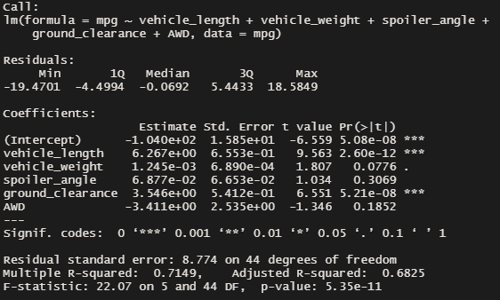
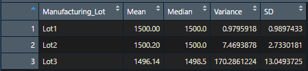

# MechaCar_Statistical_Analysis

## Linear Regression to Predict MPG

A multiple linear regression based on each vehicle's MPG and its length, weight, spoiler angle, ground clearance and AWD type has determined that vehicle's length and ground clearance provided a non-random amount of variance to the MPG values according to the p value. Please refer to the following figure for more details.

The slope of the linear model is not zero because the parameters of the linear regression model for vehicle_length and ground_clearance are non-zero.

According to the R-squared value, which is equal to 0.7149, this linear model predict the MechaCar prototypes effectively.

## Summary Statistics on Suspension Coils

The the variance of MechaCar suspension coils has been analyzed for all manufacturing lots in total and each lot individually, which are detailed in the following tables.

As shown by the first table, the variance of the three lots in total, which is 62.3, does meet the design specification of not exceeding 100 PSI. However, the second table shows that the variance of Lot 3, which is 170.3, exceeded this design specification. 

