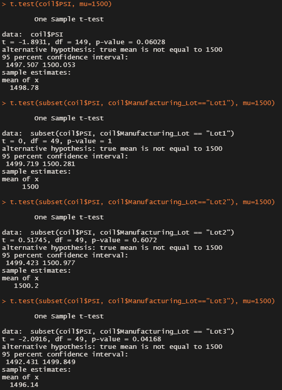

# MechaCar_Statistical_Analysis

## Linear Regression to Predict MPG

A multiple linear regression based on each vehicle's MPG and its length, weight, spoiler angle, ground clearance and AWD type has determined that vehicle's length and ground clearance provided a non-random amount of variance to the MPG values according to the *p* value. Please refer to the following figure for more details.

The slope of the linear model is not zero because the parameters of the linear regression model for *vehicle_length* and *ground_clearance* are non-zero.

According to the *R-squared* value, which is equal to 0.7149, this linear model predict the MechaCar prototypes effectively.

## Summary Statistics on Suspension Coils

The the variance of MechaCar suspension coils has been analyzed for all manufacturing lots in total and each lot individually with regard to the PSI values, which are detailed in the following tables.

As shown by the first table, the variance of the three lots in total, which is 62.3, does meet the design specification of not exceeding 100 PSI. However, the second table shows that the variance of Lot 3, which is 170.3, exceeded this design specification. 

## T-Tests on Suspension Coils

To determine whether the mean PSI values are equal to the population mean 1500 for the lots in total and each lot individually, one-sample t-tests were performed and the results are shown below.

Using *p*=0.05 as the significance level, it is suggested that the coils manufactured by Lot 3 is significantly different from the population mean although all the lots in total does NOT show significant difference.

## Study Design: MechaCar vs Competition

The comparison of MechaCar against competitors could include the following metrics: cost, safety rating, horse power and fuel efficiency.

Using these metrics, one may carry out the comparison by testing the null hypothesis that there is no difference between MechaCar and competitors.

For each metric, the *ANOVA* test can be used to first find out if there are significant differences among the car makers. If yes, then a series of two-sample *t*-tests can be carried out to compare MechaCar against each individual competitor and find out the position of MechaCar among all competitors.

Since the above metrics vary significantly among car classes even by the same maker, data of each vehicle model need to be grouped based on car classes and thus become the samples for statistical tests. In another word, comparison should be performed for the same car classes among different car makers include MechaCar.

